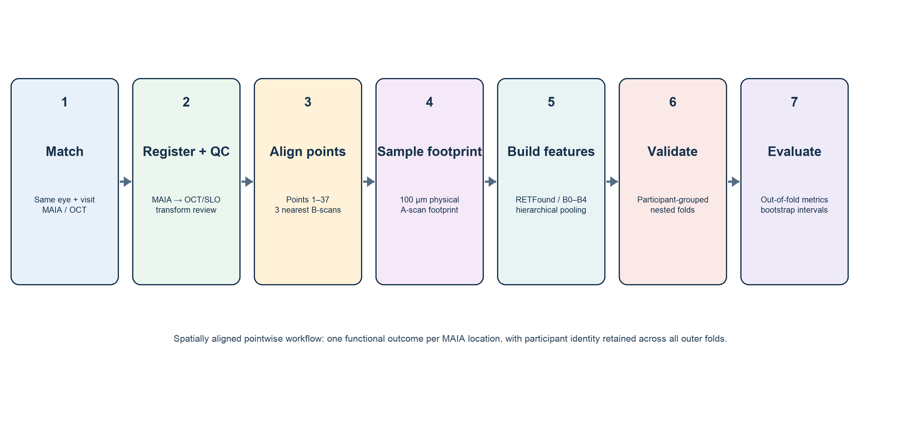
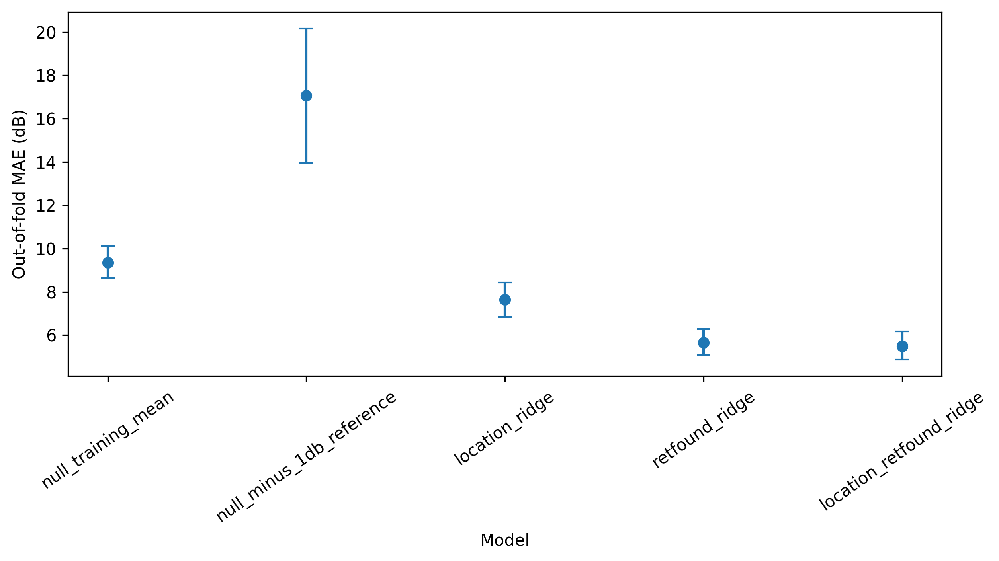

# Predicting Retinal Sensitivity from OCT

[](https://www.python.org/)
[](https://github.com/shreeyachandel/retinal-sensitivity-prediction/actions/workflows/tests.yml)
[](LICENSE)

MSc Artificial Intelligence for Biomedicine and Healthcare thesis project on
predicting pointwise retinal sensitivity from optical coherence tomography
(OCT) in Usher syndrome.

Built an end-to-end multimodal machine-learning pipeline aligning OCT imaging
with pointwise microperimetry. The best participant-held-out model reduced MAE
from **7.650 dB to 5.485 dB** across **22 participants and 2,886 observations**.

**Stack:** Python · scikit-learn · pandas · NumPy · Matplotlib · Jupyter ·
LaTeX · RETFound

[Run the notebook in Colab](https://colab.research.google.com/github/shreeyachandel/retinal-sensitivity-prediction/blob/main/notebooks/retinal_sensitivity_demo.ipynb)
· [Open the public dissertation](output/pdf/public-thesis.pdf)
· [Browse the research pipeline](research_code/README.md)



## Research question

Can spatially aligned local OCT structure help predict the retinal sensitivity
measured at individual MAIA microperimetry points?

The project connects two complementary measurements:

- **OCT:** fast, objective cross-sectional imaging of retinal structure.
- **Microperimetry:** pointwise functional sensitivity, but slower and dependent
  on participant attention and response.

The aim was to test whether local OCT information adds predictive value—not to
claim that imaging can replace functional testing.

## What I built

- A reproducible multimodal pipeline for matching OCT and microperimetry at
  participant, eye, visit and retinal-point level.
- Automated registration candidates with saved human quality-control decisions.
- Three-nearest-B-scan mapping and local, footprint-aware OCT sampling.
- Frozen RETFound image representations and interpretable structural features.
- Participant-grouped nested validation to prevent correlated points, eyes or
  visits from leaking across train and test sets.
- Evaluation using MAE, RMSE, calibration and Bland–Altman agreement, with
  uncertainty estimated at participant level.

## What is available here

| Material | Purpose | Status |
|---|---|---|
| [Public dissertation](output/pdf/public-thesis.pdf) | Full MSc thesis | Two retinal QC images replaced with synthetic schematics |
| [Research pipeline](research_code/README.md) | 37 modules covering registration through evaluation | Research implementation prepared for public review |
| [Runnable notebook](notebooks/retinal_sensitivity_demo.ipynb) | End-to-end grouped modelling demonstration | Executes entirely on generated data |
| [Aggregate results](results/README.md) | Headline figures and metrics | Reported thesis figures and tables |

## Key result

The primary analysis included **22 participants, 78 accepted eye-visits and
2,886 pointwise observations**. The location-plus-RETFound ridge model achieved
the lowest primary MAE:

| Model | MAE (dB) | RMSE (dB) | Bias (dB) | R² |
|---|---:|---:|---:|---:|
| Location-only ridge | 7.650 | 9.048 | 0.004 | 0.268 |
| RETFound-only ridge | 5.652 | 7.146 | −0.245 | 0.543 |
| **Location + RETFound ridge** | **5.485** | **6.986** | **−0.060** | **0.564** |



The combined model improved on location alone, but its Bland–Altman limits of
agreement remained wide (−13.754 to 13.634 dB). This supports a measurable
structure–function relationship within the cohort while also showing why the
predictions should not be treated as interchangeable with microperimetry.

## Run the public demo

The demo generates invented `SYN-###` participants and evaluates three compact
models with five participant-held-out folds.

```bash
git clone https://github.com/shreeyachandel/retinal-sensitivity-prediction.git
cd retinal-sensitivity-prediction
python3 -m venv .venv
source .venv/bin/activate
python -m pip install -e ".[dev]"
retinal-demo
python -m unittest discover -s tests -v
```

Generated metrics and a three-panel evaluation figure are written to
`artifacts/`. On Windows PowerShell, activate the environment with
`.venv\Scripts\Activate.ps1`.

The notebook provides the same workflow interactively:

```bash
jupyter lab notebooks/retinal_sensitivity_demo.ipynb
```

## Repository structure

```text
.
├── data/                  # Brief data-access note
├── docs/
│   ├── thesis-public-source/ # Buildable source for the public dissertation
│   └── research-summary.md   # Concise study overview
├── notebooks/             # Runnable synthetic demonstration
├── output/pdf/            # Full public dissertation
├── research_code/         # Research implementation for code review
├── results/               # Safe aggregate figures from the thesis
├── scripts/               # Rebuilds figures and extracts public code
├── src/retinal_sensitivity/
│   ├── data.py            # Deterministic synthetic cohort generator
│   ├── modeling.py        # Leakage-safe grouped cross-validation
│   ├── evaluation.py      # Error and agreement metrics/plots
│   └── demo.py            # Command-line workflow
└── tests/                 # Reproducibility and leakage checks
```

## Data note

Clinical imaging data are not included because they are not publicly
shareable. The repository provides the full public dissertation, aggregate
results, research code and a synthetic runnable demo.

## Limitations

- Small, rare-disease cohort and internal validation only.
- Repeated point measurements do not create 2,886 independent participants.
- The MAIA −1 dB device floor censors severe loss and had higher prediction
  error.
- Registration and feature-extraction quality can materially affect downstream
  estimates.
- The synthetic demo demonstrates software design, not the reported clinical
  result.

## Author

**Shreeya Chandel**  
MSc Artificial Intelligence for Biomedicine and Healthcare

Original code in this repository is available under the [MIT License](LICENSE).
The dissertation remains copyright Shreeya Chandel; see
[thesis licensing](THESIS_LICENSE.md). Research data and non-public artefacts
are not licensed or distributed. Third-party components retain their own
terms; see [third-party notices](THIRD_PARTY_NOTICES.md).
